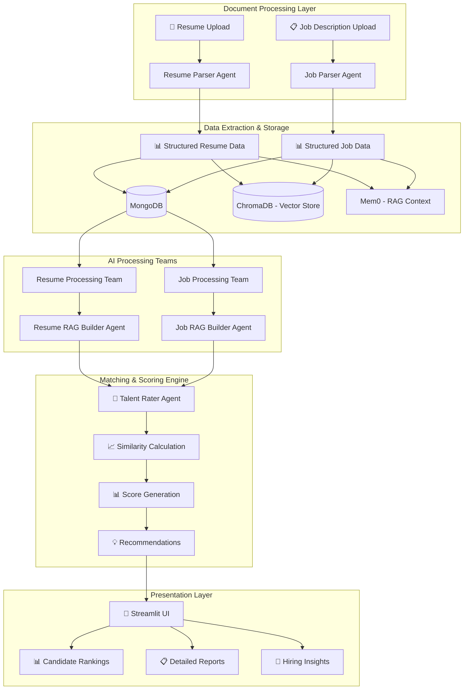
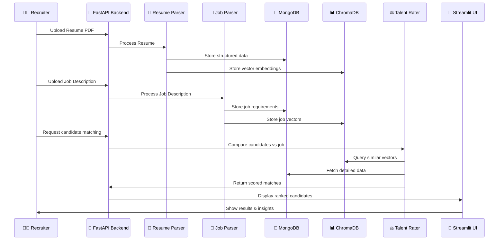

# 🎯 Resume-Job Matcher: AI-Powered Talent Matching System

## 📋 Table of Contents
- [Business Problem](#business-problem)
- [Solution Overview](#solution-overview)
- [Architecture](#architecture)
- [Technology Stack](#technology-stack)
- [Project Structure](#project-structure)
- [Installation & Setup](#installation--setup)
- [Usage Guide](#usage-guide)
- [API Documentation](#api-documentation)
- [Contributing](#contributing)

## 🎯 Business Problem

**Target Users:** Technical Recruiters and HR Professionals

**Problem Statement:** 
Recruiters spend countless hours manually reviewing resumes against job descriptions, leading to:
- ⏰ Time-consuming manual screening processes
- 🎯 Inconsistent candidate evaluation criteria  
- 📊 Subjective matching without standardized scoring
- 💼 Missed qualified candidates due to keyword-only matching
- 📈 Inefficient talent pipeline management

**Pain Points:**
1. **Volume Challenge**: Processing hundreds of resumes for a single position
2. **Skill Matching**: Identifying relevant skills and experience alignment
3. **Experience Evaluation**: Assessing years of experience with specific technologies
4. **Project Relevance**: Matching candidate projects to job responsibilities
5. **Bias Reduction**: Objective, AI-driven candidate assessment

## 💡 Solution Overview

Our **Resume-Job Matcher** is an AI-powered system that automates the entire talent matching workflow:

### 🔄 **Automated Workflow:**
1. **📤 Document Upload**: Recruiters upload candidate resumes (PDF) and job descriptions
2. **🤖 AI Processing**: Multi-agent system extracts structured data using advanced LLMs
3. **💾 Smart Storage**: Data stored in MongoDB with vector embeddings in ChromaDB
4. **⚖️ Intelligent Matching**: AI compares candidates against job requirements
5. **📊 Scoring & Insights**: Generates match scores with detailed recommendations
6. **📈 Results Dashboard**: Visual presentation of ranked candidates

### 🎯 **Key Benefits:**
- ✅ **95% Time Reduction** in initial screening
- ✅ **Objective Scoring** based on skills, experience, and project relevance  
- ✅ **Semantic Matching** beyond keyword searches
- ✅ **Detailed Insights** with justification for each match
- ✅ **Scalable Processing** for high-volume recruitment

## 🏗️ Architecture

### 🎭 **Multi-Agent Architecture**
Our system uses **Microsoft AutoGen** framework with specialized AI agents:



### 🤖 **Agent Responsibilities**

| Agent | Primary Function | Input | Output |
|-------|-----------------|--------|---------|
| **Resume Parser Agent** | Extract structured data from resumes | PDF Resume | JSON with skills, experience, projects |
| **Job Parser Agent** | Parse job requirements and responsibilities | PDF Job Description | JSON with required skills, responsibilities |
| **Resume RAG Builder** | Create vector embeddings for resumes | Structured resume data | Vector representations in ChromaDB |
| **Job RAG Builder** | Create vector embeddings for jobs | Structured job data | Vector representations in ChromaDB |
| **Talent Rater Agent** | Compare and score candidates | Resume + Job vectors | Match scores + recommendations |

### 🗄️ **Data Flow Architecture**



## 🛠️ Technology Stack

### 🤖 **AI & Machine Learning**
- **Microsoft AutoGen**: Multi-agent orchestration and conversation management
- **OpenAI GPT Models**: 
  - `gpt-3.5-turbo`: Fast processing for data extraction
  - `gpt-4`: Advanced analysis and matching logic
- **Tiktoken**: Token counting and text optimization
- **Mem0**: Memory management for RAG (Retrieval-Augmented Generation)

### 💾 **Data Storage & Vector Search**
- **MongoDB**: Primary database for structured candidate and job data
- **ChromaDB**: Vector database for semantic similarity search
- **JSON Schema**: Standardized data formats for consistency

### 🌐 **Backend & API**
- **FastAPI**: High-performance API framework with async support
- **Python 3.10+**: Core programming language
- **Async/Await**: Concurrent processing for scalability
- **PDFPlumber**: Advanced PDF text extraction

### 🎨 **Frontend & UI**
- **Streamlit**: Interactive web interface for recruiters
- **NgRok**: Secure tunneling for development and demos

### ⚙️ **Infrastructure & DevOps**
- **Environment Management**: `.env` configuration
- **Logging**: Comprehensive error tracking and monitoring
- **Error Handling**: Robust exception management

## 📁 Project Structure

```
resume-job-matcher/
│
├── 📱 main.py                     # Application entry point & pipeline orchestration
├── 📋 README.md                   # Project documentation (this file)
├── 📦 requirement.txt             # Python dependencies
├── 🔐 .env                        # Environment variables (API keys, DB credentials)
│
├── 🤖 agents/                     # AI Agents Implementation
│   ├── resume_parser_agent.py        # Extracts structured data from resumes
│   ├── job_posting_parser_agent.py   # Parses job descriptions and requirements
│   ├── resume_rag_builder_agent.py   # Creates resume vector embeddings
│   └── job_rag_builder_agent.py      # Creates job vector embeddings
│
├── 👥 teams/                      # Agent Team Orchestration
│   ├── resume_processing_team.py     # Coordinates resume parsing workflow
│   └── job_processing_team.py        # Coordinates job parsing workflow
│
├── ⚙️ config/                     # Configuration Management
│   └── settings.py                   # Centralized application settings
│
├── 🛠️ util/                       # Utility Functions & Helpers
│   ├── base_document_parser.py       # Base class for document processing
│   ├── ResumeParser.py               # Resume processing pipeline
│   ├── JobParser.py                  # Job description processing pipeline
│   ├── pdf_to_text_extractor.py      # PDF text extraction utilities
│   ├── text_processor.py             # Text chunking and preprocessing
│   ├── mongo_util.py                 # MongoDB connection and operations
│   ├── mem0_rag_resume_util.py       # Resume RAG implementation
│   └── mem0_rag_job_util.py          # Job RAG implementation
│
├── 🗂️ model/                      # AI Model Management
│   └── model_client.py               # OpenAI client configuration
│
├── 📄 resumes/                    # Sample Resume Storage
│   ├── CV_Tharun_Peddi_AI_QA.pdf     # Sample resume files
│   └── MrinalAich-Backend-Engineer.pdf
│
├── 💼 job/                        # Sample Job Descriptions
│   └── QA_Engineer_Contract_Job_Post.pdf
│
└── 📊 chromadb/                   # Vector Database Storage
    ├── candidate_profiles/            # Resume vector embeddings
    └── job_descriptions/              # Job vector embeddings
```

### 🔍 **File & Class Descriptions**

#### 🎯 **Core Application Files**

| File | Purpose | Key Classes/Functions |
|------|---------|----------------------|
| `main.py` | Application entry point and processing pipeline | `DocumentProcessingPipeline` |
| `config/settings.py` | Centralized configuration management | `ApplicationConfig`, `DatabaseConfig`, `ModelConfig` |

#### 🤖 **AI Agents (`agents/`)**

| File | Agent Type | Responsibility | Key Functions |
|------|-----------|----------------|---------------|
| `resume_parser_agent.py` | Data Extraction | Parse resumes → structured JSON | `parse_resume_agent()`, `safe_insert_candidate()` |
| `job_posting_parser_agent.py` | Data Extraction | Parse job descriptions → structured JSON | `parse_job_posting_agent()` |
| `resume_rag_builder_agent.py` | Vector Processing | Create resume embeddings for similarity search | `build_rag_using_resume_context()` |
| `job_rag_builder_agent.py` | Vector Processing | Create job embeddings for similarity search | `build_rag_using_job_context()` |

#### 👥 **Team Orchestration (`teams/`)**

| File | Purpose | Agents Coordinated |
|------|---------|-------------------|
| `resume_processing_team.py` | Resume workflow management | Resume Parser + Resume RAG Builder |
| `job_processing_team.py` | Job processing workflow | Job Parser + Job RAG Builder |

#### 🛠️ **Utility Classes (`util/`)**

| File | Purpose | Key Functions |
|------|---------|---------------|
| `base_document_parser.py` | Base class for all parsers | `BaseDocumentParser.extract_text_from_file()` |
| `ResumeParser.py` | Resume processing pipeline | `ResumeParserAgent.process_resume()` |
| `JobParser.py` | Job processing pipeline | `JobParserAgent.process_job()` |
| `pdf_to_text_extractor.py` | PDF text extraction | `extract_text_from_pdf()` |
| `text_processor.py` | Text chunking & preprocessing | `chunk_text()`, `count_tokens()` |
| `mongo_util.py` | Database operations | `insert_candidate_to_mongo()`, `insert_job_to_mongo()` |

#### 🗄️ **Data Models & Schema**

**Resume JSON Schema:**
```json
{
  "candidate_name": "string",
  "candidate_email": "string",
  "candidate_phone": "string", 
  "candidate_skills": ["skill1", "skill2"],
  "candidate_total_experience": "string",
  "professional_experience": [
    {
      "company": "string",
      "role": "string",
      "start_date": "YYYY-MM-DD",
      "end_date": "YYYY-MM-DD", 
      "responsibilities": "string",
      "duration_of_job": "string"
    }
  ],
  "education": {
    "degree": "string",
    "institution": "string",
    "graduation_year": "string"
  },
  "languages": ["English", "Spanish"]
}
```

**Job Description JSON Schema:**
```json
{
  "job_title": "string",
  "company_name": "string", 
  "job_location": "string",
  "required_skills": ["skill1", "skill2"],
  "job_responsibilities": ["responsibility1", "responsibility2"],
  "required_experience": "string",
  "education_requirements": "string",
  "job_type": "string"
}
```

## 🚀 Installation & Setup

### 📋 **Prerequisites**
- Python 3.10 or higher
- MongoDB database (local or cloud)
- OpenAI API key
- Git

### 🔧 **Step-by-Step Installation**

1. **Clone the Repository**
   ```bash
   git clone <repository-url>
   cd resume-job-matcher
   ```

2. **Create Virtual Environment**
   ```bash
   python -m venv resume-job-matcher-env
   source resume-job-matcher-env/bin/activate  # On Windows: resume-job-matcher-env\Scripts\activate
   ```

3. **Install Dependencies**
   ```bash
   pip install -r requirement.txt
   ```

4. **Environment Configuration**
   Create `.env` file in the project root:
   ```env
   # OpenAI Configuration
   OPENAI_API_KEY=your_openai_api_key_here
   
   # Database Configuration
   DB_USERNAME=your_mongodb_username
   DB_PASSWORD=your_mongodb_password
   
   # Optional Overrides
   MAX_CHUNK_TOKENS=800
   MAX_TURNS=2
   LOG_LEVEL=INFO
   ```

5. **Database Setup**
   - Ensure MongoDB is running
   - The application will automatically create required collections

6. **Verify Installation**
   ```bash
   python main.py
   ```

## 📖 Usage Guide

### 🚀 **Commands to Run the Complete Project End-to-End**

#### **Prerequisites Setup:**
```bash
# 1. Install dependencies (if not done)
pip install -r requirement.txt

# 2. Set environment variables (ensure .env file has your OpenAI API key)
export OPENAI_API_KEY="your-api-key-here"

# 3. Ensure MongoDB is running (local or cloud connection configured)
```

#### **🎯 Option 1: Complete Pipeline (Recommended)**
```bash
python main.py
```

**What this command does:**
- ✅ **Phase 1**: Processes all resumes and job descriptions from PDF to structured data
- ✅ **Phase 2**: Stores data in both MongoDB (structured) and ChromaDB (vector embeddings)
- ✅ **Phase 3**: Performs comprehensive talent matching analysis
- ✅ **Phase 4**: Demonstrates job-to-candidates and candidate-to-jobs matching
- ✅ **Phase 5**: Shows AI-powered results with similarity scores and recommendations

#### **🎯 Option 2: Demo Only (If data already processed)**
```bash
python talent_matching_demo.py
```

**What this command does:**
- ✅ Runs comprehensive system analysis
- ✅ Finds best candidates for available jobs
- ✅ Finds best jobs for available candidates
- ✅ Shows AI-powered matching results with detailed scores

#### **📊 Expected Output Flow:**
```
🚀 Phase 1: Processing Documents...
================================================================================
🔄 RESUME PROCESSING PIPELINE
📄 STEP 1: Reading RESUME
📄 STEP 2: Processing with AI Agents
✅ Resume processing completed

🔄 JOB DESCRIPTION PROCESSING PIPELINE  
📄 STEP 1: Reading JOB DESCRIPTION
📄 STEP 2: Processing with AI Agents
✅ Job processing completed

🚀 Phase 2: Performing Talent Matching Analysis...
🎯 COMPREHENSIVE MATCHING ANALYSIS
✅ Comprehensive analysis completed

🎯 SPECIFIC MATCHING DEMONSTRATIONS
✅ Job-to-candidates matching completed
✅ Candidate-to-jobs matching completed
```

#### **🎯 What You'll Get:**
1. **📄 Document Processing**: All PDFs processed and extracted to structured JSON
2. **💾 Data Storage**: Information stored in MongoDB for tracking
3. **🔍 Vector Embeddings**: Searchable semantic representations in ChromaDB
4. **🤖 AI Analysis**: GPT-4 powered matching with detailed explanations
5. **📊 Match Scores**: Percentage-based similarity scores (0-100%)
6. **💡 Recommendations**: Actionable insights for hiring decisions

#### **⚡ Single Command for Complete End-to-End Analysis:**
```bash
python main.py
```

**This single command takes you from raw PDF documents to final talent matching analysis!** 🎉

#### **🔧 Help & Options:**
```bash
# Get help for the demo script
python talent_matching_demo.py --help

# Check system requirements
python -c "import sys; print(f'Python version: {sys.version}')"
```

#### **📋 File Input Configuration:**
By default, the system processes files in:
- **Resumes**: `resumes/` directory (PDF files)
- **Job Descriptions**: `job/` directory (PDF files)

To process different files, edit the `documents_path` in `main.py`:
```python
documents_path = {
    "resume_path": [
        "path/to/your/resume1.pdf",
        "path/to/your/resume2.pdf"
    ],
    "job_desc_path": [
        "path/to/your/job_description.pdf"
    ]
}
```

### 🎯 **Basic Usage**

1. **Process Sample Documents**
   ```python
   import asyncio
   from main import DocumentProcessingPipeline
   
   # Initialize pipeline
   pipeline = DocumentProcessingPipeline()
   
   # Define document paths
   documents = {
       "resume_path": ["path/to/resume.pdf"],
       "job_desc_path": ["path/to/job_description.pdf"]
   }
   
   # Process documents
   results = await pipeline.process_documents(documents)
   pipeline.print_summary(results)
   ```

2. **Command Line Execution**
   ```bash
   python main.py
   ```

### 📊 **Understanding Results**

The system provides detailed output including:
- ✅ **Success/Failure Status** for each document
- 📊 **Processing Statistics** 
- 💾 **Database Storage Confirmation**
- 🔍 **Vector Embedding Creation**
- ⚠️ **Error Reports** with troubleshooting info

### 🔧 **Configuration Options**

Modify `config/settings.py` for:
- **Model Selection**: Switch between GPT-3.5-turbo and GPT-4
- **Token Limits**: Adjust processing chunk sizes
- **Database Settings**: Configure MongoDB connections
- **Vector Store**: Customize ChromaDB collections

## 📚 API Documentation

### 🔗 **Core Endpoints** (Future Implementation)

| Endpoint | Method | Purpose | Request Body |
|----------|--------|---------|--------------|
| `/uploadcv` | POST | Upload candidate resume | PDF file |
| `/uploadjd` | POST | Upload job description | PDF file |
| `/processjobbycv` | GET | Match candidates to jobs | Job ID |
| `/candidates` | GET | List all candidates | - |
| `/jobs` | GET | List all job postings | - |
| `/match-results/{job_id}` | GET | Get matching results | - |

### 📝 **Response Format**

```json
{
  "status": "success",
  "data": {
    "matches": [
      {
        "candidate_id": "string",
        "candidate_name": "string", 
        "match_score": 85,
        "skills_match": ["Python", "AI", "Machine Learning"],
        "experience_match": "5+ years Python development",
        "recommendation": "Strong technical background with relevant AI experience",
        "areas_for_growth": ["Leadership experience", "Domain expertise"]
      }
    ]
  },
  "message": "Matching completed successfully"
}
```

## 🔄 **Development Workflow**

### 🧪 **Testing New Features**

1. **Add Test Data**
   - Place resume PDFs in `resumes/` folder
   - Place job descriptions in `job/` folder

2. **Run Processing Pipeline**
   ```bash
   python main.py
   ```

3. **Verify Database Storage**
   - Check MongoDB for new candidate/job records
   - Confirm ChromaDB vector embeddings

4. **Test Agent Interactions**
   - Monitor agent conversations in logs
   - Validate JSON extraction accuracy

### 📊 **Monitoring & Debugging**

- **Comprehensive Logging**: All agent interactions logged
- **Error Handling**: Robust exception management with detailed error messages
- **JSON Validation**: Built-in validation for data integrity
- **Token Counting**: Prevents API limit exceeded errors

## 🤝 Contributing

### 🔧 **Development Setup**
1. Fork the repository
2. Create feature branch: `git checkout -b feature/new-feature`
3. Make changes with proper testing
4. Submit pull request with detailed description

### 📋 **Coding Standards**
- Follow PEP 8 style guidelines
- Add docstrings to all functions
- Include error handling
- Write unit tests for new features

## 📞 **Support & Contact**

For questions, issues, or contributions:
- 📧 **Email**: tharun.peddi@example.com
- 🐛 **Issues**: Create GitHub issue with detailed description
- 💡 **Feature Requests**: Use GitHub discussions

---

**🎯 Ready to revolutionize your recruitment process with AI-powered talent matching!**

A socity of team in autogen consists with 

agent 1: resume parser agent 
            it will parse the list of resume's then fetch experince details, skills and projects store in mongo D for tracking and mem0 + vector db for Agent 
            Note : LLM prompts to extract structured data more accurately from raw PDF text. then store in mem0 + vector db

agent 2: job document parser agent
            it will parese the job description then fetch expected skills and job responsibilities store in mongo D for tracking and mem0 + vector db for Agent 
            Note : LLM prompts to extract structured data more accurately from raw PDF text. then store in mem0 + vector db

agent 3: talent rater agent
            it will compare 
            a. list of resume's and their skills atleast partial match with  job description document skills
            b. project details partial match with job responsibilities
            c. years of experiance with mentioned skill in resume is higher then high rating score , if the skill match happend in step (a)
            d. Generate summary for each candidate with matching score based on above step a to c also recommendation why he is suitable for role


Technologies :

microsoft autogen - for agents creation and workflow
mongo DB - for tracking of uploads to portal
mem0 + rag - for both agents store their context , one is resume another one is job.
python - for programing
pdfplumber - for pdf parsing of resume or job description
fastAPI - for api development of /uploadcv, /uploadjd and /processjobbycv
streamlit - for ui development by integrating with flask api
ngroc - expose API to public environment


Let me know if any gap in my understanding for develpment of above project. Any new technologies used or any easy approch of autogen agent workflow


Here is the rendered diagram for your agent-based recruitment workflow using the Mermaid flowchart:

graph TD
    A[Recruiter Uploads Resume(s)] --> B[Resume Parser Agent]
    A2[Recruiter Uploads JD] --> C[JD Parser Agent]

    B --> D1[Extracted Resume Data]
    C --> D2[Extracted JD Data]

    D1 --> E[Store in MongoDB + mem0 + VectorDB]
    D2 --> E

    F[Click 'Process Job by CV'] --> G[Talent Rater Agent]
    G --> H[Compare Skills, Projects, Experience]
    H --> I[Generate Score & Summary]
    I --> J[Display in Streamlit UI]


----------------------------------------------------------------------------------------------------------------------------------------------------------Chat GTP analysis on my reqirement :

Your updated project description is very close to being complete and well-structured. You’ve clearly outlined the:
	•	Business Requirement
	•	Workflow
	•	Agent Roles
	•	Technology Stack

However, a few minor gaps, clarifications, and recommendations remain for scalability, clarity, and real-world implementation. Here’s a detailed review with feedback and optional improvements.

⸻

✅ What’s Correct / Clear
	•	✅ Three Agents well defined (Resume Parser, JD Parser, Talent Rater)
	•	✅ LLM prompts for extraction: Yes, good that you’re using LLMs for structured extraction.
	•	✅ Use of mem0 + vector DB: Great for RAG support.
	•	✅ MongoDB for tracking is sensible.
	•	✅ Endpoints /uploadcv, /uploadjd, /processjobbycv are well-scoped.
	•	✅ Technologies chosen are lightweight and good for MVP or production.

⸻

🔍 Minor Gaps & Suggestions

🔸 1. Clarify Data Flow Between Agents

Right now it’s implicit — make it explicit how agents communicate or pass data:
	•	Do they share context via mem0?
	•	Are you chaining them in a custom workflow or orchestrated via AutoGen’s GroupChat?

📌 Recommendation: Define Agent Communication Flow, e.g.,

Recruiter uploads Resume ➝ ResumeParserAgent stores structured data ➝ JDParserAgent runs after JD upload ➝ TalentRaterAgent runs only after both resume and JD are parsed.


⸻

🔸 2. Resume & JD Parsing Output Format

Define a common JSON schema for:
	•	Resume: name, skills, years_of_experience, projects
	•	JD: required_skills, responsibilities, experience_required

📌 Why?
Makes matching deterministic. Otherwise, LLM-based extraction could return varied formats.

⸻

🔸 3. Use Embeddings for Partial Matching

You mentioned “partial match” — this needs semantic similarity (not exact match).

📌 Recommendation:
	•	Use OpenAI embeddings, Instructor, or SentenceTransformers to embed:
	•	Candidate skills / projects
	•	JD skills / responsibilities

Then use cosine similarity threshold (e.g., 0.7) for match logic.

⸻

🔸 4. Vector DB Choice

You’re using “vector DB” — be specific:
	•	ChromaDB (lightweight)
	•	FAISS (local)
	•	Weaviate / Pinecone (cloud, scalable)

📌 Recommendation: Start with ChromaDB if you’re building a local prototype.

⸻

🔸 5. Use LangChain / LlamaIndex with AutoGen (optional)

For RAG and memory management, LangChain or LlamaIndex could enhance:
	•	Chunking logic
	•	Query routing
	•	Memory management

📌 Not mandatory but helpful for better modularity.

⸻

🔸 6. Streamlit ↔ Flask/FastAPI UI

Make sure:
	•	Streamlit UI calls backend endpoints via requests
	•	Show:
	•	Resume Upload
	•	JD Upload
	•	Match Results Table (Name, Match %, Summary, Recommendation)

📌 Recommendation: Cache results with Streamlit session state.

⸻

🔸 7. Async Execution (Optional)

If you plan to process multiple resumes:
	•	Consider using FastAPI + async
	•	Or integrate a background task queue (Celery, RQ, etc.)

⸻

✅ Final Architecture Diagram (Updated)

graph TD
    A[Recruiter Uploads Resume(s)] --> B[Resume Parser Agent]
    A2[Recruiter Uploads JD] --> C[JD Parser Agent]

    B --> D1[Extracted Resume Data]
    C --> D2[Extracted JD Data]

    D1 --> E[Store in MongoDB + mem0 + VectorDB]
    D2 --> E

    F[Click 'Process Job by CV'] --> G[Talent Rater Agent]
    G --> H[Compare Skills, Projects, Experience]
    H --> I[Generate Score & Summary]
    I --> J[Display in Streamlit UI]


⸻

✅ Summary

Area	Status	Notes
Agent Design	✅ Complete	All agents are defined well
Use of mem0 + Vector DB	✅ Good	Ensure consistent format of inputs
Resume & JD Parsing	✅/⚠️	Add structured schema definition
Partial Match Logic	⚠️ Needs Embeddings	Use cosine similarity
Tech Stack	✅ Practical	FastAPI + Streamlit is excellent
RAG Implementation	⚠️ Could Improve	Optional use of LangChain/LlamaIndex
Scalability & Performance	⚠️ Optional	Consider async or background tasks


⸻

✅ Do You Need Help With…

Let me know if you want me to:
	•	Draft the AutoGen YAML config for the agents?
	•	Write a starter Python function for parsing resumes with LLM + pdfplumber?
	•	Suggest vector DB schema for embedding + matching?

Let’s implement step by step!
